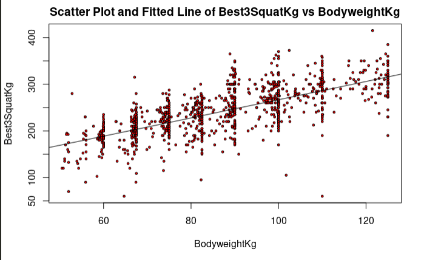
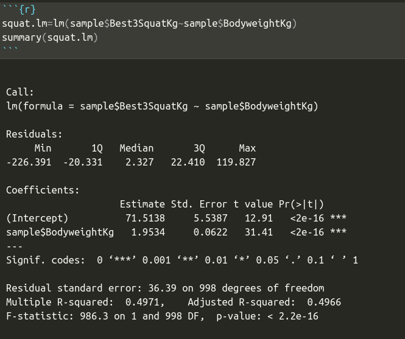

```{r setup, include=FALSE}
knitr::opts_chunk$set(echo = FALSE)
```

## Abstract

Powerlifting

- Squat
{ width=30% }

- Bench Press
{ width=30% }
- Deadlift
{ width=30% }


## Introduction

{ width=20% }

- Got into Weightlifting this year

- Thought it would be a cool idea to make my assignment about it

## The Data
Data comes from a dataset compiled by powerlifters from powerlifters going to meets

{ width=100% }
Variables to consider for cleanup:

- Age
- Drug Tested
- Sex
- NA values

## ggplot Squat ~ Bodyweight

{ width=100% }


## Background

-How were the data collected? 

-What is the story behind the data?

-Why was it gathered?

-What is your interest in the data?

-What problem do you wish to solve?

-What is my Hypothesis?

## Theory needed to carry out SLR

{ width=100% }

## The Assumptions

{ width=100% }

## Carry out SLR

{ width=100% }

## Validity - verifying assumptions

<h1>Independence of data</h1>
 <br/>
 
The error associated with one value of y has no effect on the errors associated with other y values.

I think we can make the claim that other weightlifters won't effect the lift of other weightlifters in any significant way. With this claim, this assumption that y's are independent of one another is true.


## Finding RSS
{ width=100% }


## Finding TSS
{ width=100% }


## R squared

{ width=50% }

{ width=50% }


## Trendscatter on Residual Vs Fitted

{ width=70% }

-Linearity assumption is met, because the blue line is quite linear.

-Variation is constant assumption is met. These points don't show any pattern and just look like a cloud of points.

## Test for Normality

$$\epsilon_i \sim N(0,\sigma^2)$$

{ width=80% }


## Estimating the Parameters

{ width=60% }

## Results
Squat:

β0^ = 71.5138
<br/>
β1^ = 1.9534
<br/>
R^2 = 0.4971


Bench:

β0^ = 33.88057
<br/>
β1^ = 1.34571
<br/>
R^2 = 0.5053


Deadlift:

β0^ = 118.9751
<br/>
β1^ = 1.5167
<br/>
R^2 = 0.4489

## CI's
{ width=50% }

## Cooks plot
{ width=100% }

## Conclusion

{ width=100% }

## References

-Wikipedia. 2018a. “Cook’s Distance.” https://en.wikipedia.org/wiki/Cook%27s_distance.
-Cheng, Jaime. “Relationship Goals - A Powerlifter's Lesson on Linear Regression.” Medium, Medium, 17 Aug. 2020, medium.com/@jaimejcheng/relationship-goals-a-powerlifters-lesson-on-linear-regression-5c6eb5b359d5. 
-jbstatistics. “Simple Linear Regression: Checking Assumptions with Residual Plots.” YouTube, YouTube, 5 Dec. 2012, www.youtube.com/watch?v=iMdtTCX2Q70. 
-marinstatlectures. “Checking Linear Regression Assumptions in R | R Tutorial 5.2 | MarinStatsLectures.” YouTube, YouTube, 13 Nov. 2013, www.youtube.com/watch?v=eTZ4VUZHzxw. 
-Mendenhall, William, and Terry Sincich. Statistics for Engineering and the Sciences. Prentice Hall, 1995. 
-“OpenPowerlifting Data.” OpenPowerlifting, www.openpowerlifting.org/data. 


